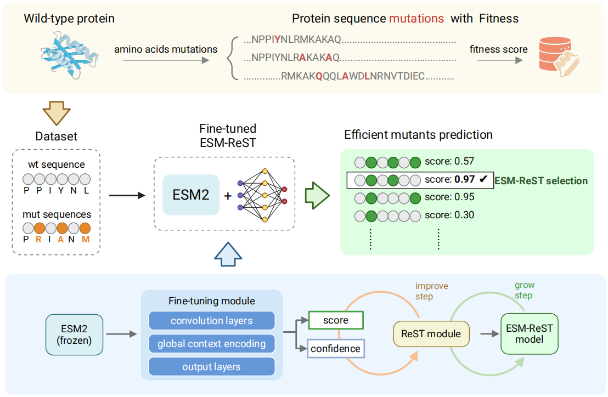

# ESM-ReST: Protein Fitness Prediction Model

This project uses ESM-2 embeddings and a ReST-based self-training framework to predict protein mutant fitness.


## Project Structure

- `config/`: Contains YAML configuration files.
- `src/`: Contains all Python source code.
  - `train.py`: Main entry point of the project.
  - `config.py`: Defines Pydantic models for configuration.
  - `dataset.py`: PyTorch dataset and data loader related code.
  - `model.py`: Model architectures such as `ESM2Effect`.
  - `trainer.py`: `Trainer` class that encapsulates training and ReST logic.
  - `utils.py`: Utility functions such as data processing and plotting.
- `requirements.txt`: Project dependencies.

## How to Run

1.  **Install dependencies**:
    ```bash
    pip install -r requirements.txt
    ```

2.  **Prepare data**:
    Ensure your `data.csv` file path is correct and update `data_path` and `wt_seq` in `config/base_config.yaml`.

3.  **Start training**:
    Run from the `protein_project` root directory:
    ```bash
    python src/train.py --config_path config/base_config.yaml
    ```

4.  **Override parameters (optional)**:
    You can override parameters from the configuration file directly in the command line:
    ```bash
    python src/train.py --config_path config/base_config.yaml --lr 5e-5 --batch_size 16
    ```
